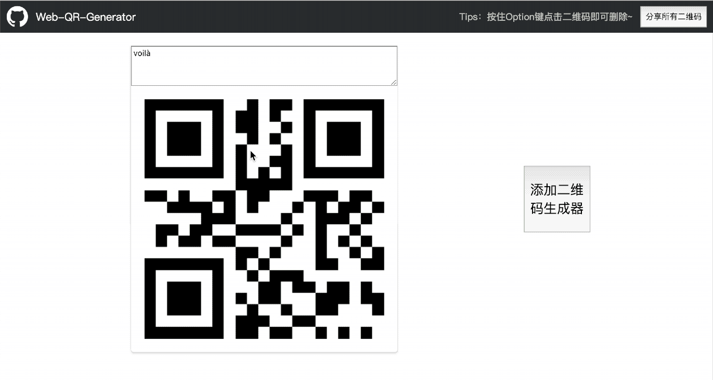

二维码工厂
-----
这是一个在线二维码生成器，主要功能：
1. 生成多个二维码，并支持添加、删除、修改功能
2. 编辑后实时更新二维码
3. 支持本地存储二维码，关闭页面后已经生成的二维码不会丢失
4. 分享二维码链接，对方打开分享的链接即可立即使用所有二维码

立即体验 [https://mimers.github.io/Web-QR-Generator/](https://mimers.github.io/Web-QR-Generator/)

> 纯前端的二维码生成方案，使用JS版QR Code库[qrcodejs](https://github.com/davidshimjs/qrcodejs)库。
